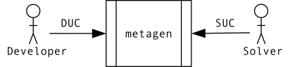

.. include:: aliases.rst

Welcome to |metagen|!
=====================

|metagen| is a Python scientific package designed to provide users with a standard system for solution representation, methods to generate and modify these solutions, and a standard interface between the metaheuristic and potential users. These features make it easier for programmers to develop a metaheuristic and make it accessible to any user who wants to optimize a problem during the crucial hyperparameter tuning process in machine learning model production.

    |metagen|'s overview.

As shown in :numref:`fig-overview`, |metagen| provides users with two user profiles:

- **Developer**: It implements a metaheuristic using the |solution| class. This profile deploys the **Development use case (DUC)** in which it uses |metagen| to develop a new metaheuristic algorithm, simplifying the coding process and making it accessible to any user who wants to solve a problem.
- **Solver**: It defines a problem using the tools offered by the |domain| class and implements a fitness function to optimize by using the |solution| class to get the values of the variables of a potential solution. Finally, it uses those elements (the |domain| and the fitness function) to solve a problem by applying a metaheuristic. This use case is called **Solving use case (SUC)**. The metaheuristic, used by the *Solver* to solve the problem, can be included in |metagen| (i.e., *Random Search*, *CVOA*, *Genetic Algorithm*, etc or be implemented by a third party (the *Developer*). The *Solver* only needs to know how a class is instantiated and how a method is called.

For more details, please refer to the :doc:`understanding_metagen/index` section.

Main features
-------------

- **User-friendly development**: Developers do not need in-depth knowledge of Object-Oriented programming to create new metaheuristics.
- **Standard interface**: It provides a standard interface that isolates the developer from the end user, facilitating seamless development.
- **Dynamic optimization of deep learning architectures**: Tools for dynamically adjusting deep learning model architectures, including layers and hyperparameters, during execution.
- **Python-type hints**: The use of Python's typing features simplifies the development process and debugging.
- **Implemented metaheuristics**: It offers a robust selection of algorithms, providing flexibility for solving various optimization problems.
- **User-friendly problem domain definition**: It  simplifies the representation of problem domains by eliminating the need for complex object-oriented artifacts and using intuitive methods to define search spaces.

Installation
-------------

using pip:

.. code-block:: console

   (.venv) $ pip install pymetagen-datalabupo

Index
-----

.. toctree::
    :maxdepth: 2

    understanding_metagen/index
    metagen_in_action/index
    performance_tracking/index
    distributed_execution/index
    api

