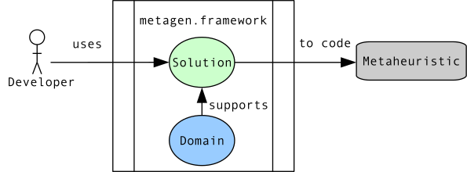
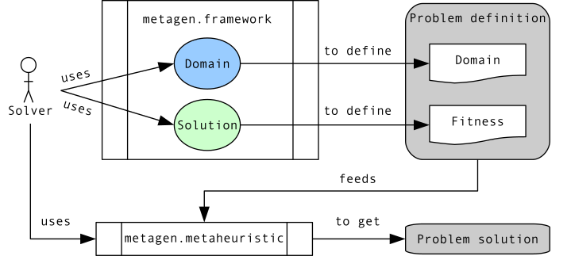

.. include:: ../aliases.rst

===============
User profiles
===============

- **[DUC]** Development Use Case: |metagen|'s is used by a developer to program a new metaheuristic algorithm, simplifying the development process and making it accessible to any user who wants to optimize a problem.
- **[SUC]** Solving Use Case: |metagen|'s is used by a solver to define an optimization problem and use a metaheuristic to find the best hyperparameter configuration for a specific machine or deep learning model.

    **DUC**: Development Use Case.

The core of |metagen| is located in the :mod:`metagen.framework` package; it contains the logic to support both use cases.

    **SUC**: Solving Use Case.

The Solving Use Case figure shows how the :mod:`metagen.framework` package helps a solver to define its own hyperparameter application domains by setting the range of variable values through the |domain| class and to define a fitness function using the standard interface with potential solutions treated by the metaheuristic, provided by the Solution class. The :mod:`metagen.metaheuristics` package includes several developed metaheuristics. A solver defines a problem using the Domain class and solves it with one of these available metaheuristics (or another implemented by a third-party developer).
